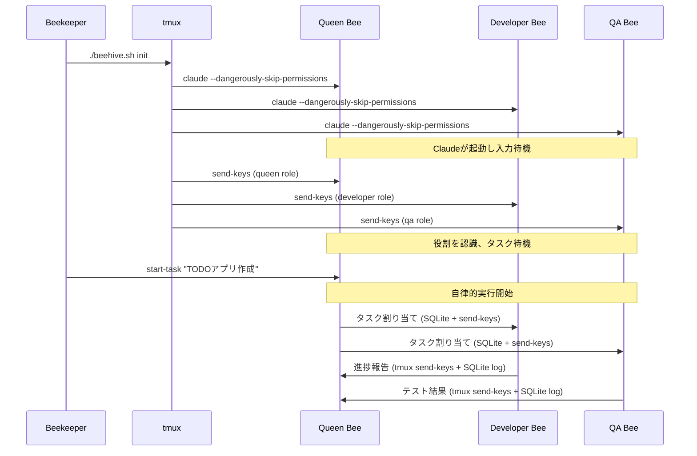

# Claude Multi-Agent Development System (Beehive)

AIエージェントが協調して開発タスクを遂行する、tmuxベースのマルチエージェントシステム

## 概要

本プロジェクトは、蜂の巣（Beehive）をモデルとしたマルチエージェントシステムです。Queen Beeが計画・指示を行い、Worker Bee（Developer/QA）が実装・評価を担当します。各エージェントはtmuxセッション内で動作し、**tmux send-keysによる直接通信**と**SQLiteによるログ・状態管理**により協調動作します。

### 🎯 現在の実装状況
- ✅ **Phase 1: 基本的な自律実行システム** (Issue #4完了)
  - Python Beeクラス群による自律実行機能
  - Queen→Worker タスク割り当て機能
  - Worker→Queen 結果報告機能
  - tmux + SQLite 通信アーキテクチャ

## システム構成

```
👤 Beekeeper (人間)
    └── 📋 初期タスクを投入

🐝 Queen Bee (計画・指示)
    ├── 📋 タスク分解
    ├── 📊 進捗管理
    └── 🎯 Worker への指示

🔨 Worker Bee (Developer Role)
    ├── 💻 コード実装
    └── 📤 Queen への報告

🔍 Worker Bee (QA Role)  
    ├── 🧪 テスト実行
    └── 📤 Queen への報告
```

## 重要な動作原理

### 🔧 通信アーキテクチャ
- **メイン通信**: `tmux send-keys`によるClaude間の直接メッセージ送信
- **ログ・状態管理**: SQLiteによる永続化（タスク状態、進捗、履歴）
- **構造化メッセージ**: Markdown形式でのタスク情報交換

### 🚀 実行フロー
1. **Bee の起動**: 各Beeはtmuxのpane内で `claude --dangerously-skip-permissions` として起動され、入力を待機します
2. **役割の注入**: 起動後、`tmux send-keys`で各Beeに役割（role）を送信します。この段階ではタスクは開始しません
3. **タスクの開始**: Beekeeper（人間）がQueenにタスクを投入すると、Queen主導で自律的なマルチエージェント実行が始まります
4. **自律実行**: PythonクラスによるBee間の自動タスク分解・割り当て・報告が実行されます

## 前提条件

- macOS または Linux
- 以下のツールがインストール済み：
  - tmux (>= 3.0)
  - sqlite3
  - Python 3.12+ （Beeクラス実行用）
  - claude CLI (`claude --dangerously-skip-permissions`が実行可能)

## クイックスタート

```bash
# リポジトリのクローン
git clone https://github.com/nyasuto/hive.git
cd hive

# 依存関係の確認
make install

# データベースの初期化
python3 bees/init_test_db.py

# 蜂の巣を起動（Beeたちが待機状態になる）
./beehive.sh init

# 役割を注入
./beehive.sh inject-roles

# タスクを投入（これによりマルチエージェント実行が開始）
./beehive.sh start-task "TODOアプリを作成してください"

# 状態を確認
./beehive.sh status

# 蜂の巣を停止
./beehive.sh stop
```

### 🧪 テスト実行
```bash
# Python Beeクラスのテスト
python3 bees/test_tmux_communication.py

# 品質チェック
make check
```

## 起動シーケンス



## プロジェクト構造

```
hive/
├── beehive.sh                      # メインのオーケストレーター
├── Makefile                        # 開発用コマンド集
├── .gitignore                      # Git除外設定
├── scripts/
│   ├── init_hive.sh               # tmuxセッション作成とClaude起動
│   ├── inject_roles.sh            # 役割の注入
│   ├── task_manager.sh            # タスク管理ユーティリティ
│   └── (その他のスクリプト)
├── bees/                          # 🐝 Python自律実行システム (Issue #4)
│   ├── base_bee.py               # 基底Beeクラス（tmux+SQLite通信）
│   ├── queen_bee.py              # Queen Bee（タスク管理・割り当て）
│   ├── worker_bee.py             # Worker Bee（作業実行・報告）
│   ├── init_test_db.py           # データベース初期化
│   └── test_*.py                 # テストスイート
├── roles/                         # 各Beeの役割定義
│   ├── queen.md                  # Queen Beeのプロンプト
│   ├── developer.md              # Developer役のプロンプト
│   └── qa.md                     # QA役のプロンプト
├── hive/
│   ├── schema.sql                # データベーススキーマ
│   └── hive_memory.db            # 共有データベース（自動生成）
├── workspaces/                   # 各Beeの作業ディレクトリ
│   ├── queen/
│   ├── developer/
│   └── qa/
└── logs/                         # ログディレクトリ（自動生成）
```

### 🐝 Python Beeクラスの階層構造

```python
BaseBee                          # 基底クラス（通信・データベース）
├── QueenBee                     # タスク管理・割り当て・監視
└── WorkerBee                    # 作業実行・進捗報告
    ├── DeveloperBee (将来実装)   # 開発専門
    └── QABee (将来実装)         # QA専門
```

## 役割定義の例

### roles/queen.md
```markdown
# Queen Bee Role Definition

## 初期化確認
あなたはQueen Beeとして初期化されました。
Beekeeperからタスクが投入されるまで待機してください。

## タスク受信時の振る舞い
Beekeeperからタスクを受信したら：
1. タスクを分析し、サブタスクに分解
2. Developer BeeとQA Beeに適切に割り当て
3. 進捗を監視し、必要に応じて調整

## 通信プロトコル
- **Worker Beeへの指示**: tmux send-keysで構造化メッセージを直接送信、SQLiteにログ記録
- **Worker Beeからの報告**: tmux send-keysで構造化報告を送信、SQLiteに状態・進捗記録
- **状態管理**: SQLiteによるハートビート・ワークロード・履歴管理

## 重要：コンテキスト維持
- 定期的に送信される[CONTEXT REMINDER]を確認すること
- 元のタスクと現在の進捗を常に意識すること
```

### roles/developer.md
```markdown
# Developer Bee Role Definition

## 初期化確認
あなたはDeveloper Beeとして初期化されました。
Queen Beeからの指示を待機してください。

## 責務
- Queen Beeからのタスクを実装
- 実装完了後、成果物と共に報告
- QA Beeのフィードバックに基づく修正

## 制約
- Queen Beeの指示なしに作業を開始しない
- 作業範囲は指示されたタスクに限定

## 重要：役割の維持
- 定期的な[ROLE REMINDER]を確認し、自分の役割を忘れないこと
- 実装に集中するあまり、報告を忘れないこと
```

## beehive.sh の主要コマンド

```bash
# 蜂の巣を初期化（Claudeを起動し役割を注入）
./beehive.sh init

# タスクを投入（Queen経由で実行開始）
./beehive.sh start-task "タスクの説明"

# 各Beeの状態を確認
./beehive.sh status

# 特定のBeeのログを確認
./beehive.sh logs queen

# tmuxセッションに接続
./beehive.sh attach

# コンテキストリマインダーの手動実行
./beehive.sh remind

# 蜂の巣を停止
./beehive.sh stop
```

## データベーススキーマ（主要テーブル）

```sql
-- タスクキュー
CREATE TABLE tasks (
    id INTEGER PRIMARY KEY,
    parent_task_id INTEGER,
    assigned_to TEXT,
    assigned_by TEXT,
    status TEXT,
    content JSON,
    created_at TIMESTAMP DEFAULT CURRENT_TIMESTAMP
);

-- Bee間メッセージ
CREATE TABLE bee_messages (
    id INTEGER PRIMARY KEY,
    from_bee TEXT,
    to_bee TEXT,
    message_type TEXT,
    content JSON,
    processed BOOLEAN DEFAULT FALSE,
    created_at TIMESTAMP DEFAULT CURRENT_TIMESTAMP
);

-- Beeの状態管理
CREATE TABLE bee_states (
    bee_name TEXT PRIMARY KEY,
    status TEXT,
    current_task_id INTEGER,
    last_heartbeat TIMESTAMP
);

-- コンテキスト保持（忘却対策）
CREATE TABLE context_snapshots (
    id INTEGER PRIMARY KEY,
    bee_name TEXT,
    snapshot_type TEXT,
    content JSON,
    created_at TIMESTAMP DEFAULT CURRENT_TIMESTAMP
);

-- 重要な決定事項の記録
CREATE TABLE decision_log (
    id INTEGER PRIMARY KEY,
    bee_name TEXT,
    decision TEXT,
    rationale TEXT,
    task_id INTEGER,
    created_at TIMESTAMP DEFAULT CURRENT_TIMESTAMP
);
```

## 忘却対策機能

### 1. 定期的なコンテキストリマインダー
- 5分ごとに各Beeに役割とタスクのリマインダーを送信
- tmuxのステータスラインに現在のタスクを常時表示

### 2. チェックポイントシステム
- 重要な決定や進捗を自動的にスナップショット
- タスク遷移時に前タスクのサマリーを生成

### 3. 視覚的強化
```bash
# tmuxのペインタイトルに役割を表示
tmux select-pane -t beehive:0 -T "[QUEEN] Planning"
tmux select-pane -t beehive:1 -T "[DEV] Implementing"
tmux select-pane -t beehive:2 -T "[QA] Testing"
```

## トラブルシューティング

### Claudeが起動しない
```bash
# Claudeコマンドの確認
which claude
claude --version

# 権限の確認
claude --dangerously-skip-permissions --help
```

### Beeが役割を認識しない
```bash
# 役割注入の再実行
./scripts/inject_roles.sh

# tmuxペインの内容確認
tmux capture-pane -t beehive:0 -p
```

### Beeが役割を忘れている
```bash
# 手動でリマインダーを送信
./beehive.sh remind --bee developer

# コンテキスト履歴を確認
sqlite3 hive/hive_memory.db "SELECT * FROM context_snapshots WHERE bee_name='developer' ORDER BY created_at DESC LIMIT 5"
```

### タスクが開始されない
```bash
# Queenの状態確認
sqlite3 hive/hive_memory.db "SELECT * FROM bee_states WHERE bee_name='queen'"

# メッセージキューの確認
sqlite3 hive/hive_memory.db "SELECT * FROM bee_messages WHERE processed=0"
```

## 開発ロードマップ

### Phase 1: 基本的な自律実行システム ✅ 完了
- ✅ tmux内でのClaude起動
- ✅ send-keysによる役割注入  
- ✅ Beekeeperからのタスク投入
- ✅ **Python Beeクラスによる自律実行** (Issue #4)
  - ✅ Queen→Worker タスク割り当て機能
  - ✅ Worker→Queen 結果報告機能
  - ✅ tmux + SQLite 通信アーキテクチャ
  - ✅ 構造化メッセージシステム

### Phase 2: 強化 (次フェーズ)
- [ ] **忘却対策システム** (Issue #5予定)
  - [ ] 定期的なコンテキストリマインダー
  - [ ] チェックポイント機能
  - [ ] 決定事項の永続化
  - [ ] 視覚的役割強化
- [ ] エラーリカバリー
- [ ] 実行状態の可視化
- [ ] タスクの中断・再開

### Phase 3: 拡張 (将来計画)
- [ ] 専門Beeクラス（DeveloperBee, QABee, ArchitectBee等）
- [ ] 動的なBee追加・削除
- [ ] 複数プロジェクトの並行実行
- [ ] 実行履歴の分析機能
- [ ] パフォーマンス最適化

## 使用方法・API

### 🐝 Python Beeクラスの使用例

```python
from bees.queen_bee import QueenBee
from bees.worker_bee import WorkerBee

# Queen Beeでタスク管理
queen = QueenBee("hive/hive_memory.db")
task_id = queen.create_task("Create user authentication", "Implement JWT-based auth")
queen.assign_task_to_bee(task_id, "developer", "Core security feature")

# Worker Beeで作業実行
developer = WorkerBee("developer", "development", "hive/hive_memory.db")
developer.accept_task(task_id)
developer.report_progress(task_id, 50, "JWT integration complete")
developer.complete_task(task_id, "Auth system implemented", ["auth.py", "tests.py"])
```

### 📊 データベース監視

```bash
# タスク状況確認
sqlite3 hive/hive_memory.db "SELECT * FROM tasks WHERE status='pending'"

# Bee状態確認
sqlite3 hive/hive_memory.db "SELECT * FROM bee_states"

# 通信履歴確認
sqlite3 hive/hive_memory.db "SELECT * FROM bee_messages ORDER BY created_at DESC LIMIT 10"
```

### 🛠️ 開発用コマンド

```bash
# 品質チェック
make check

# テスト実行
python3 bees/test_tmux_communication.py

# プロジェクト分析
make analyze

# PR準備
make pr-ready
```

---

## 🎯 現在の達成状況

✅ **基本的な自律実行システム完成** (2024年実装)
- Python Beeクラス群による完全自律動作
- tmux + SQLite ハイブリッド通信
- Queen→Worker 双方向タスク管理
- 包括的テストスイート

**次のフェーズ**: Issue #5 忘却対策システムの実装予定