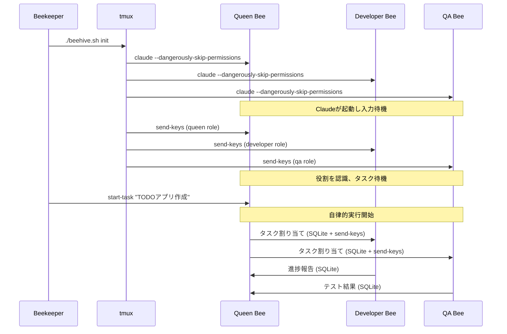

# Claude Multi-Agent Development System (Beehive)

AIエージェントが協調して開発タスクを遂行する、tmuxベースのマルチエージェントシステム

## 概要

本プロジェクトは、蜂の巣（Beehive）をモデルとしたマルチエージェントシステムです。Queen Beeが計画・指示を行い、Worker Bee（Developer/QA）が実装・評価を担当します。各エージェントはtmuxセッション内で動作し、SQLiteとtmux send-keysを通じて通信します。

## システム構成

```
👤 Beekeeper (人間)
    └── 📋 初期タスクを投入

🐝 Queen Bee (計画・指示)
    ├── 📋 タスク分解
    ├── 📊 進捗管理
    └── 🎯 Worker への指示

🔨 Worker Bee (Developer Role)
    ├── 💻 コード実装
    └── 📤 Queen への報告

🔍 Worker Bee (QA Role)  
    ├── 🧪 テスト実行
    └── 📤 Queen への報告
```

## 重要な動作原理

1. **Bee の起動**: 各Beeはtmuxのpane内で `claude --dangerously-skip-permissions` として起動され、入力を待機します
2. **役割の注入**: 起動後、`tmux send-keys`で各Beeに役割（role）を送信します。この段階ではタスクは開始しません
3. **タスクの開始**: Beekeeper（人間）がQueenにタスクを投入すると、Queen主導で自律的なマルチエージェント実行が始まります

## 前提条件

- macOS または Linux
- 以下のツールがインストール済み：
  - tmux (>= 3.0)
  - sqlite3
  - Python 3.12+, uv, ruff
  - claude CLI (`claude --dangerously-skip-permissions`が実行可能)

## クイックスタート

```bash
# リポジトリのクローン
git clone <repository>
cd claude-beehive

# 初期セットアップ
./scripts/setup.sh

# 蜂の巣を起動（Beeたちが待機状態になる）
./beehive.sh init

# タスクを投入（これによりマルチエージェント実行が開始）
./beehive.sh start-task "TODOアプリを作成してください"

# 状態を確認
./beehive.sh status

# 蜂の巣を停止
./beehive.sh stop
```

## 起動シーケンス



## プロジェクト構造

```
claude-beehive/
├── beehive.sh                 # メインのオーケストレーター
├── scripts/
│   ├── setup.sh              # 初期セットアップ
│   ├── init_hive.sh          # tmuxセッション作成とClaude起動
│   ├── inject_roles.sh       # 役割の注入
│   ├── reminder_daemon.sh    # コンテキスト強化デーモン
│   └── monitor.sh            # 監視スクリプト
├── bees/
│   ├── base_bee.py           # 基底Beeクラス（通信機能）
│   ├── queen_bee.py          # Queen Bee（指示系の追加機能）
│   └── worker_bee.py         # Worker Bee（報告系の追加機能）
├── roles/                    # 各Beeの役割定義
│   ├── queen.md              # Queen Beeのプロンプト
│   ├── developer.md          # Developer役のプロンプト
│   └── qa.md                 # QA役のプロンプト
├── memory/                   # 忘却対策用のコンテキスト管理
│   ├── context_manager.py    # コンテキスト管理システム
│   └── templates/            # リマインダーテンプレート
├── hive/
│   ├── schema.sql            # データベーススキーマ
│   └── hive_memory.db        # 共有メモリ（自動生成）
├── workspaces/               # 各Beeの作業ディレクトリ
│   ├── queen/
│   ├── developer/
│   └── qa/
└── logs/                     # ログディレクトリ（自動生成）
```

## 役割定義の例

### roles/queen.md
```markdown
# Queen Bee Role Definition

## 初期化確認
あなたはQueen Beeとして初期化されました。
Beekeeperからタスクが投入されるまで待機してください。

## タスク受信時の振る舞い
Beekeeperからタスクを受信したら：
1. タスクを分析し、サブタスクに分解
2. Developer BeeとQA Beeに適切に割り当て
3. 進捗を監視し、必要に応じて調整

## 通信プロトコル
- Worker Beeへの指示: SQLiteにタスク登録後、通知をsend-keys
- Worker Beeからの報告: SQLiteを定期的にポーリング

## 重要：コンテキスト維持
- 定期的に送信される[CONTEXT REMINDER]を確認すること
- 元のタスクと現在の進捗を常に意識すること
```

### roles/developer.md
```markdown
# Developer Bee Role Definition

## 初期化確認
あなたはDeveloper Beeとして初期化されました。
Queen Beeからの指示を待機してください。

## 責務
- Queen Beeからのタスクを実装
- 実装完了後、成果物と共に報告
- QA Beeのフィードバックに基づく修正

## 制約
- Queen Beeの指示なしに作業を開始しない
- 作業範囲は指示されたタスクに限定

## 重要：役割の維持
- 定期的な[ROLE REMINDER]を確認し、自分の役割を忘れないこと
- 実装に集中するあまり、報告を忘れないこと
```

## beehive.sh の主要コマンド

```bash
# 蜂の巣を初期化（Claudeを起動し役割を注入）
./beehive.sh init

# タスクを投入（Queen経由で実行開始）
./beehive.sh start-task "タスクの説明"

# 各Beeの状態を確認
./beehive.sh status

# 特定のBeeのログを確認
./beehive.sh logs queen

# tmuxセッションに接続
./beehive.sh attach

# コンテキストリマインダーの手動実行
./beehive.sh remind

# 蜂の巣を停止
./beehive.sh stop
```

## データベーススキーマ（主要テーブル）

```sql
-- タスクキュー
CREATE TABLE tasks (
    id INTEGER PRIMARY KEY,
    parent_task_id INTEGER,
    assigned_to TEXT,
    assigned_by TEXT,
    status TEXT,
    content JSON,
    created_at TIMESTAMP DEFAULT CURRENT_TIMESTAMP
);

-- Bee間メッセージ
CREATE TABLE bee_messages (
    id INTEGER PRIMARY KEY,
    from_bee TEXT,
    to_bee TEXT,
    message_type TEXT,
    content JSON,
    processed BOOLEAN DEFAULT FALSE,
    created_at TIMESTAMP DEFAULT CURRENT_TIMESTAMP
);

-- Beeの状態管理
CREATE TABLE bee_states (
    bee_name TEXT PRIMARY KEY,
    status TEXT,
    current_task_id INTEGER,
    last_heartbeat TIMESTAMP
);

-- コンテキスト保持（忘却対策）
CREATE TABLE context_snapshots (
    id INTEGER PRIMARY KEY,
    bee_name TEXT,
    snapshot_type TEXT,
    content JSON,
    created_at TIMESTAMP DEFAULT CURRENT_TIMESTAMP
);

-- 重要な決定事項の記録
CREATE TABLE decision_log (
    id INTEGER PRIMARY KEY,
    bee_name TEXT,
    decision TEXT,
    rationale TEXT,
    task_id INTEGER,
    created_at TIMESTAMP DEFAULT CURRENT_TIMESTAMP
);
```

## 忘却対策機能

### 1. 定期的なコンテキストリマインダー
- 5分ごとに各Beeに役割とタスクのリマインダーを送信
- tmuxのステータスラインに現在のタスクを常時表示

### 2. チェックポイントシステム
- 重要な決定や進捗を自動的にスナップショット
- タスク遷移時に前タスクのサマリーを生成

### 3. 視覚的強化
```bash
# tmuxのペインタイトルに役割を表示
tmux select-pane -t beehive:0 -T "[QUEEN] Planning"
tmux select-pane -t beehive:1 -T "[DEV] Implementing"
tmux select-pane -t beehive:2 -T "[QA] Testing"
```

## トラブルシューティング

### Claudeが起動しない
```bash
# Claudeコマンドの確認
which claude
claude --version

# 権限の確認
claude --dangerously-skip-permissions --help
```

### Beeが役割を認識しない
```bash
# 役割注入の再実行
./scripts/inject_roles.sh

# tmuxペインの内容確認
tmux capture-pane -t beehive:0 -p
```

### Beeが役割を忘れている
```bash
# 手動でリマインダーを送信
./beehive.sh remind --bee developer

# コンテキスト履歴を確認
sqlite3 hive/hive_memory.db "SELECT * FROM context_snapshots WHERE bee_name='developer' ORDER BY created_at DESC LIMIT 5"
```

### タスクが開始されない
```bash
# Queenの状態確認
sqlite3 hive/hive_memory.db "SELECT * FROM bee_states WHERE bee_name='queen'"

# メッセージキューの確認
sqlite3 hive/hive_memory.db "SELECT * FROM bee_messages WHERE processed=0"
```

## 開発ロードマップ

### Phase 1: MVP (現在)
- [ ] tmux内でのClaude起動
- [ ] send-keysによる役割注入
- [ ] Beekeeperからのタスク投入
- [ ] 基本的な自律実行

### Phase 2: 強化
- [ ] **忘却対策システム**
  - [ ] 定期的なコンテキストリマインダー
  - [ ] チェックポイント機能
  - [ ] 決定事項の永続化
  - [ ] 視覚的役割強化
- [ ] エラーリカバリー
- [ ] 実行状態の可視化
- [ ] タスクの中断・再開

### Phase 3: 拡張
- [ ] 動的なBee追加（Architect, Security等）
- [ ] 複数プロジェクトの並行実行
- [ ] 実行履歴の分析機能

## 次のステップ

この設計に基づいて、以下の順序で実装を進めます：

1. `scripts/init_hive.sh` - tmux起動とClaude待機
2. `hive/schema.sql` - データベース設計（忘却対策テーブル含む）
3. `roles/queen.md` - Queen役割定義
4. `scripts/inject_roles.sh` - 役割注入スクリプト
5. `memory/context_manager.py` - コンテキスト管理システム

どこから始めましょうか？