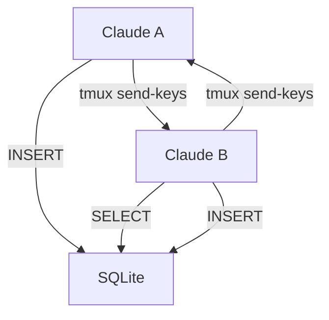

# 🛠️ Beehive 開発者ガイド

Claude Multi-Agent Development System の包括的開発ガイド

## 📋 目次

- [環境セットアップ](#環境セットアップ)
- [アーキテクチャ理解](#アーキテクチャ理解)
- [開発ワークフロー](#開発ワークフロー)
- [実装ガイドライン](#実装ガイドライン)
- [テスト戦略](#テスト戦略)
- [デバッグ・トラブルシューティング](#デバッグトラブルシューティング)

---

## 環境セットアップ

### 前提条件

```bash
# 必須ツールの確認
tmux --version    # >= 3.0
python --version  # >= 3.12
claude --version  # 最新版
uv --version      # Python パッケージマネージャー
```

### 開発環境構築

#### 1. リポジトリセットアップ

```bash
# リポジトリクローン
git clone https://github.com/nyasuto/hive.git
cd hive

# 依存関係インストール
make install

# 開発用ツール設定
make dev-setup
```

#### 2. データベース初期化

```bash
# SQLiteデータベース作成
python bees/init_test_db.py

# 確認
sqlite3 hive/hive_memory.db ".tables"
```

#### 3. 設定ファイル

デフォルト設定は `bees/config.py` で管理されています：

```python
@dataclass
class BeehiveConfig:
    session_name: str = "beehive"
    hive_db_path: str = "hive/hive_memory.db"
    log_level: str = "INFO"
    db_timeout: float = 30.0
    pane_mapping: dict[str, str] = field(default_factory=lambda: {
        "queen": "0.0",
        "developer": "0.1", 
        "qa": "0.2",
        "analyst": "0.3"
    })
```

環境変数でオーバーライド可能：

```bash
export BEEHIVE_SESSION_NAME="my_hive"
export BEEHIVE_LOG_LEVEL="DEBUG"
export BEEHIVE_DB_PATH="custom/path/hive.db"
```

### IDE設定推奨

#### VS Code設定 (.vscode/settings.json)

```json
{
    "python.defaultInterpreter": "./.venv/bin/python",
    "python.linting.enabled": true,
    "python.linting.ruffEnabled": true,
    "python.formatting.provider": "black",
    "python.testing.pytestEnabled": true,
    "python.testing.unittestEnabled": false,
    "files.exclude": {
        "**/.pytest_cache": true,
        "**/htmlcov": true,
        "**/__pycache__": true
    }
}
```

---

## アーキテクチャ理解

### 1. 通信プロトコル

**SQLite + tmux send-keys** による双方向通信：



### 2. コア構成要素

#### BaseBee クラス階層

```python
BaseBee                 # 基底通信クラス
├── QueenBee           # タスク管理・調整
└── WorkerBee          # 作業実行基底
    ├── DeveloperBee   # コード実装
    ├── QABee          # テスト・品質保証
    └── AnalystBee     # 分析・レポート
```

#### データベーススキーマ

```sql
-- メインテーブル
CREATE TABLE tasks (
    task_id INTEGER PRIMARY KEY,
    title TEXT NOT NULL,
    description TEXT,
    status TEXT CHECK(status IN ('pending', 'in_progress', 'completed', 'failed')),
    priority TEXT CHECK(priority IN ('low', 'medium', 'high', 'critical')),
    assigned_to TEXT,
    created_at TIMESTAMP DEFAULT CURRENT_TIMESTAMP
);

CREATE TABLE bee_states (
    bee_name TEXT PRIMARY KEY,
    status TEXT CHECK(status IN ('idle', 'busy', 'error', 'offline')),
    current_task_id INTEGER,
    last_heartbeat TIMESTAMP,
    workload_score INTEGER DEFAULT 0
);

CREATE TABLE bee_messages (
    message_id INTEGER PRIMARY KEY,
    from_bee TEXT NOT NULL,
    to_bee TEXT NOT NULL,
    message_type TEXT NOT NULL,
    subject TEXT NOT NULL,
    content TEXT,
    task_id INTEGER,
    priority TEXT DEFAULT 'normal',
    processed BOOLEAN DEFAULT FALSE,
    created_at TIMESTAMP DEFAULT CURRENT_TIMESTAMP
);
```

### 3. tmux セッション構造

```bash
# セッション: beehive
# ペイン構成:
beehive:0.0  # Queen Bee (タスク管理)
beehive:0.1  # Developer Bee (開発担当)
beehive:0.2  # QA Bee (品質保証)
beehive:0.3  # Analyst Bee (分析担当)
```

---

## 開発ワークフロー

### 1. 新機能開発フロー

```bash
# 1. フィーチャーブランチ作成
git checkout -b feat/issue-X-new-feature

# 2. 開発前の品質チェック
make quality

# 3. 実装・テスト
# ... 開発作業 ...

# 4. 品質チェック実行
make quality
make test

# 5. コミット
git add .
git commit -m "feat: add new feature

- Implement X functionality
- Add tests for Y
- Update documentation

🤖 Generated with [Claude Code](https://claude.ai/code)

Co-Authored-By: Claude <noreply@anthropic.com>"

# 6. プッシュ・PR作成
git push -u origin feat/issue-X-new-feature
gh pr create --title "feat: add new feature" --body "..."
```

### 2. バグ修正フロー

```bash
# 1. バグ修正ブランチ
git checkout -b fix/issue-X-bug-description

# 2. 再現テスト作成
# tests/test_bug_reproduction.py

# 3. 修正実装

# 4. 検証
make test
make quality

# 5. PR作成（同様のフロー）
```

---

## 実装ガイドライン

### 1. 新しいBeeクラス作成

#### ステップ1: 基底クラス継承

```python
# bees/my_custom_bee.py
from .worker_bee import WorkerBee
from .exceptions import TaskExecutionError
from typing import Any

class MyCustomBee(WorkerBee):
    """カスタム専用Beeクラス"""
    
    def __init__(self, bee_name: str = "mycustom", config=None):
        super().__init__(bee_name, config)
        self.specialized_capability = True
```

#### ステップ2: 専用メソッド実装

```python
    def perform_specialized_task(self, task_data: dict[str, Any]) -> dict[str, Any]:
        """専用タスク実行"""
        try:
            # タスク実行ロジック
            result = self._execute_custom_logic(task_data)
            
            # 進捗報告
            self.report_progress(
                task_data["task_id"],
                100,
                "カスタムタスク完了",
                [f"result: {result}"]
            )
            
            return {"status": "success", "result": result}
            
        except Exception as e:
            self.logger.error(f"Custom task failed: {e}")
            raise TaskExecutionError(
                task_id=task_data.get("task_id", 0),
                bee_name=self.bee_name,
                stage="custom_execution",
                original_error=e
            )
```

#### ステップ3: メッセージハンドリング

```python
    def _handle_work_instruction(self, instruction: str) -> None:
        """カスタム指示処理"""
        if instruction.startswith("CUSTOM:"):
            # カスタム指示の解析・実行
            custom_task = self._parse_custom_instruction(instruction)
            result = self.perform_specialized_task(custom_task)
            
            # Queen Beeに結果報告
            self.send_message(
                to_bee="queen",
                message_type="task_completed",
                subject="カスタムタスク完了",
                content=f"結果: {result}",
                task_id=custom_task.get("task_id")
            )
        else:
            # 通常処理は親クラスに委譲
            super()._handle_work_instruction(instruction)
```

### 2. データベース操作パターン

#### トランザクション管理

```python
def create_complex_task(self, task_data: dict[str, Any]) -> int:
    """複雑なタスク作成（複数テーブル操作）"""
    try:
        with self._get_db_connection() as conn:
            # メインタスク作成
            cursor = conn.execute(
                "INSERT INTO tasks (title, description, priority) VALUES (?, ?, ?)",
                (task_data["title"], task_data["description"], task_data["priority"])
            )
            task_id = cursor.lastrowid
            
            # 依存関係登録
            if "dependencies" in task_data:
                for dep_id in task_data["dependencies"]:
                    conn.execute(
                        "INSERT INTO task_dependencies (task_id, depends_on) VALUES (?, ?)",
                        (task_id, dep_id)
                    )
            
            # 要件登録
            if "requirements" in task_data:
                for req in task_data["requirements"]:
                    conn.execute(
                        "INSERT INTO task_requirements (task_id, requirement) VALUES (?, ?)",
                        (task_id, req)
                    )
            
            conn.commit()
            self.logger.info(f"Complex task created: {task_id}")
            return task_id
            
    except Exception as e:
        self.logger.error(f"Failed to create complex task: {e}")
        raise DatabaseOperationError("create_complex_task", "multi-table insert", e)
```

### 3. エラーハンドリングパターン

#### カスタム例外の使用

```python
from .exceptions import TaskExecutionError, BeeValidationError

def validate_and_execute(self, task_data: dict[str, Any]) -> Any:
    """検証付きタスク実行"""
    # 入力検証
    if not task_data.get("title"):
        raise BeeValidationError(
            bee_name=self.bee_name,
            field="title",
            value=task_data.get("title"),
            reason="Task title is required"
        )
    
    try:
        # 実行
        return self._execute_task_logic(task_data)
        
    except Exception as e:
        # コンテキスト情報付きでラップ
        raise TaskExecutionError(
            task_id=task_data.get("task_id", 0),
            bee_name=self.bee_name,
            stage="validation_and_execution",
            original_error=e
        )
```

### 4. ログ活用パターン

#### 構造化ログ

```python
def process_important_operation(self, data: dict[str, Any]) -> None:
    """重要な操作の構造化ログ"""
    # 操作開始ログ
    self.logger.log_event(
        "operation.started",
        "Important operation started",
        operation_type="data_processing",
        data_size=len(data),
        **data.get("metadata", {})
    )
    
    try:
        # 処理実行
        result = self._perform_operation(data)
        
        # 成功ログ
        self.logger.log_event(
            "operation.completed",
            "Operation completed successfully",
            operation_type="data_processing",
            result_size=len(result),
            processing_time=self._get_processing_time()
        )
        
    except Exception as e:
        # エラーログ
        self.logger.error(
            f"Operation failed: {e}",
            error=e,
            operation_type="data_processing",
            input_data_preview=str(data)[:100]
        )
        raise
```

---

## テスト戦略

### 1. テスト構成

```bash
tests/
├── unit/                    # 単体テスト
│   ├── test_base_bee.py
│   ├── test_queen_bee.py
│   └── test_worker_bee.py
├── integration/             # 統合テスト
│   ├── test_bee_communication.py
│   └── test_task_workflow.py
├── performance/             # パフォーマンステスト
│   └── test_load_handling.py
└── conftest.py             # 共通設定
```

### 2. テスト実装例

#### 単体テスト

```python
# tests/unit/test_custom_bee.py
import pytest
from unittest.mock import Mock, patch
from bees.my_custom_bee import MyCustomBee
from bees.exceptions import TaskExecutionError

class TestMyCustomBee:
    
    @pytest.fixture
    def custom_bee(self, mock_config, temp_db):
        """カスタムBeeフィクスチャ"""
        return MyCustomBee("mycustom", mock_config)
    
    def test_specialized_task_success(self, custom_bee):
        """専用タスク成功ケース"""
        task_data = {
            "task_id": 1,
            "type": "custom_analysis",
            "input": "test_data"
        }
        
        result = custom_bee.perform_specialized_task(task_data)
        
        assert result["status"] == "success"
        assert "result" in result
    
    def test_specialized_task_failure(self, custom_bee):
        """専用タスク失敗ケース"""
        task_data = {"task_id": 1, "invalid": True}
        
        with pytest.raises(TaskExecutionError) as exc_info:
            custom_bee.perform_specialized_task(task_data)
        
        assert exc_info.value.task_id == 1
        assert exc_info.value.bee_name == "mycustom"
```

#### 統合テスト

```python
# tests/integration/test_custom_workflow.py
import pytest
from bees.queen_bee import QueenBee
from bees.my_custom_bee import MyCustomBee

class TestCustomWorkflow:
    
    def test_end_to_end_custom_task(self, temp_db_session):
        """エンドツーエンドカスタムタスクフロー"""
        # セットアップ
        queen = QueenBee("queen")
        custom_bee = MyCustomBee("mycustom")
        
        # タスク作成
        task_id = queen.create_task(
            title="カスタム分析タスク",
            description="専用ロジックによる分析",
            priority="medium"
        )
        
        # タスク割り当て
        success = queen.assign_task(task_id, "mycustom")
        assert success
        
        # タスク実行（カスタムBeeで）
        task_details = custom_bee.get_task_details(task_id)
        result = custom_bee.perform_specialized_task(task_details)
        
        # 結果検証
        assert result["status"] == "success"
        
        # 進捗確認
        progress = queen.get_task_progress(task_id)
        assert progress["status"] == "completed"
```

### 3. テスト実行

```bash
# 全テスト実行
make test

# 特定テストファイル
uv run pytest tests/unit/test_custom_bee.py -v

# カバレッジ付き
uv run pytest --cov=bees --cov-report=html

# パフォーマンステスト
uv run pytest tests/performance/ --benchmark-only
```

---

## デバッグ・トラブルシューティング

### 1. ログ解析

#### アプリケーションログ

```bash
# リアルタイムログ監視
tail -f logs/beehive.log

# 構造化ログ解析
python -c "
import json
with open('logs/beehive.log') as f:
    for line in f:
        try:
            log = json.loads(line)
            if log.get('level') == 'ERROR':
                print(f'{log[\"timestamp\"]} - {log[\"message\"]}')
        except:
            pass
"
```

#### データベースログ

```bash
# send-keys通信ログ
sqlite3 hive/hive_memory.db "
SELECT timestamp, session_name, pane_id, message_preview 
FROM send_keys_log 
ORDER BY timestamp DESC 
LIMIT 10;
"

# Bee状態確認
sqlite3 hive/hive_memory.db "
SELECT bee_name, status, last_heartbeat, workload_score
FROM bee_states
WHERE last_heartbeat > datetime('now', '-5 minutes');
"
```

### 2. tmux セッション調査

```bash
# セッション一覧
tmux list-sessions

# ペイン確認
tmux list-panes -t beehive

# 特定ペインの履歴確認
tmux capture-pane -t beehive:0.0 -p

# ペインへの直接接続
tmux attach-session -t beehive
```

### 3. 一般的な問題と対処法

#### データベース接続エラー

```python
# デバッグコード例
def debug_database_connection():
    """データベース接続デバッグ"""
    from pathlib import Path
    from bees.config import get_config
    
    config = get_config()
    db_path = Path(config.hive_db_path)
    
    print(f"Database path: {db_path}")
    print(f"Exists: {db_path.exists()}")
    print(f"Readable: {db_path.is_file()}")
    
    if db_path.exists():
        import sqlite3
        try:
            conn = sqlite3.connect(str(db_path))
            cursor = conn.execute("SELECT name FROM sqlite_master WHERE type='table'")
            tables = [row[0] for row in cursor.fetchall()]
            print(f"Tables: {tables}")
            conn.close()
        except Exception as e:
            print(f"Connection error: {e}")

# 実行
debug_database_connection()
```

#### tmux 通信エラー

```bash
# セッション再初期化
./beehive.sh stop
rm -f hive/hive_memory.db
python bees/init_test_db.py
./beehive.sh init

# 手動send-keysテスト
python -m bees.cli send beehive 0.0 "test message" --dry-run
```

#### Claude CLI 権限エラー

```bash
# 権限確認
claude --dangerously-skip-permissions --help

# 再設定
claude configure
```

### 4. パフォーマンス分析

#### メモリ使用量監視

```python
# パフォーマンス監視スクリプト
import psutil
import time
from bees.base_bee import BaseBee

def monitor_bee_performance():
    """Beeのパフォーマンス監視"""
    process = psutil.Process()
    
    bee = BaseBee("developer")
    
    print("Starting performance monitoring...")
    for i in range(10):
        # メモリ使用量
        memory_info = process.memory_info()
        print(f"Memory: RSS={memory_info.rss // 1024 // 1024}MB")
        
        # ワークロード確認
        workload = bee.get_workload_status()
        print(f"Workload: {workload}")
        
        time.sleep(5)

monitor_bee_performance()
```

### 5. 開発効率化ツール

#### デバッグ用ヘルパー関数

```python
# bees/debug_helpers.py
import json
from typing import Any
from .base_bee import BaseBee

def debug_bee_state(bee: BaseBee) -> dict[str, Any]:
    """Bee状態の包括的デバッグ情報"""
    return {
        "health": bee.get_health_status(),
        "workload": bee.get_workload_status(),
        "recent_messages": bee.get_messages(processed=False)[:5],
        "config": {
            "db_path": str(bee.hive_db_path),
            "session_name": bee.session_name,
            "pane_mapping": bee.pane_map
        }
    }

def pretty_debug(bee: BaseBee) -> None:
    """デバッグ情報の整形表示"""
    debug_info = debug_bee_state(bee)
    print(json.dumps(debug_info, indent=2, ensure_ascii=False))
```

---

## 🚀 次のステップ

### 🎯 スキルレベル別推奨

#### 初中級開発者
1. **[チュートリアル](tutorial.md)** - 実践的な理解を深める（3-4時間）
2. **[API Reference](api_reference.md)** - 詳細仕様・使用例を確認

#### 上級開発者・アーキテクト
1. **[API Reference](api_reference.md)** - 全クラス・関数の詳細仕様
2. **[運用ガイド](operations_guide.md)** - 本番運用・監視設計
3. **コントリビューション** - 新機能開発・改善提案

#### システム管理者
1. **[運用ガイド](operations_guide.md)** - 本番運用・監視ガイド（必須）
2. **[API Reference ヘルスチェック](api_reference.md#get_health_status)** - 監視API活用

### 🔗 関連セクション
- **[チュートリアル実践演習](tutorial.md#第5章-実践演習)** - 実装パターンの学習
- **[運用ガイドパフォーマンス管理](operations_guide.md#パフォーマンス管理)** - 最適化手法
- **[ドキュメント目次](README.md)** - 全体像の把握

---

**📝 このガイドについて**:
- **対象**: Beehive システムの開発者・コントリビューター
- **更新頻度**: 機能追加・変更時に随時更新
- **フィードバック**: [GitHub Issues](https://github.com/nyasuto/hive/issues) でお知らせください

**🔄 最終更新**: 2025-07-23  
**📋 対象バージョン**: v1.0.0